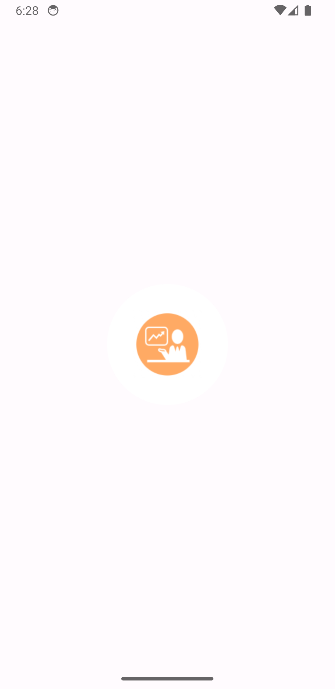
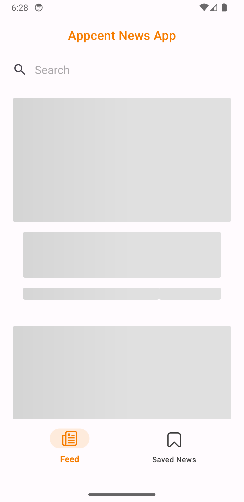
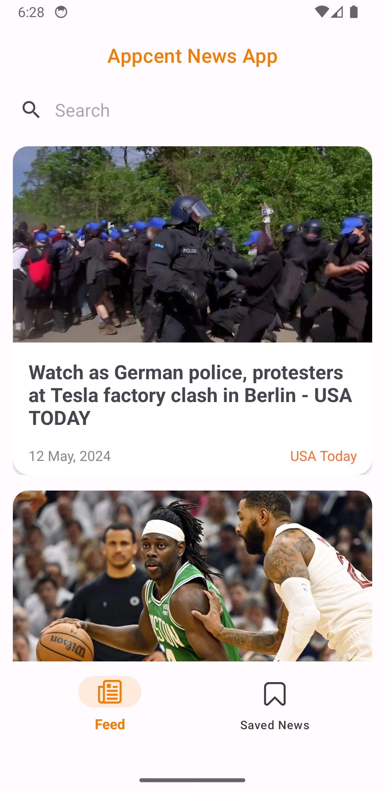
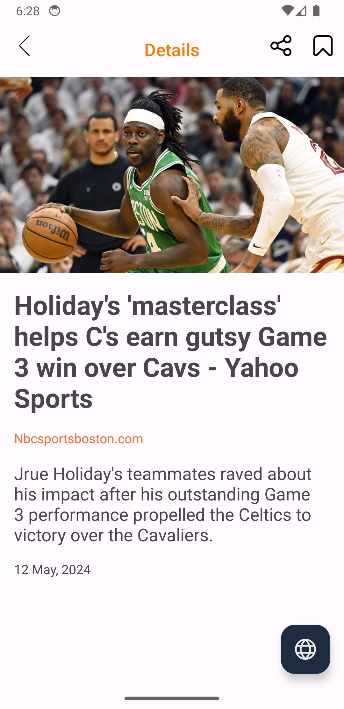
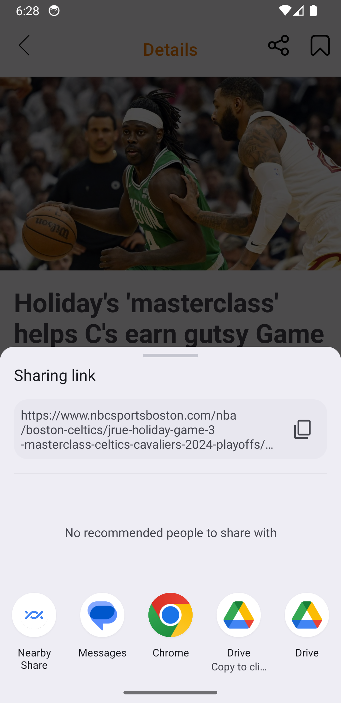
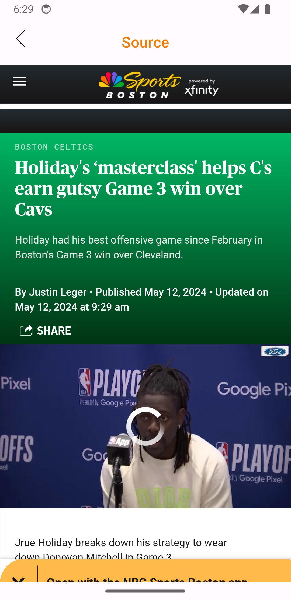
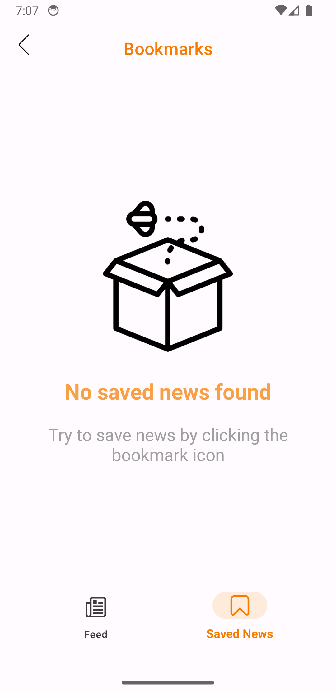
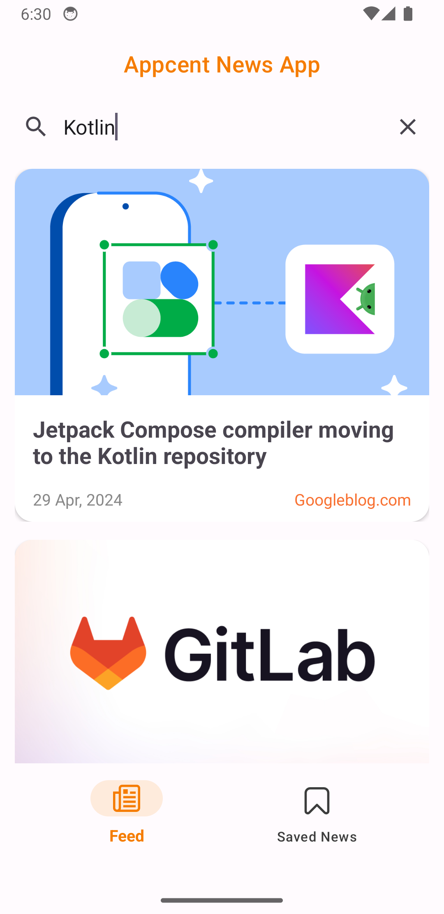

# 📰 News App

This App is developed as a learning project to get into Android development using Java. It serves as a practical exploration of various essential technologies and patterns commonly used in Android app development.

## 🏆 Features
 - Search: Users can search for news articles by entering keywords in the search bar.
 - Article Details: Users can view detailed information about each article, including the title, description, date, and source.
 - External Link: Users can visit the source website of an article by clicking on the "Go to Source" button.
 - Bookmarking: Users can bookmark articles to save them for later viewing.
 - Favorites Tab: Users can view their bookmarked articles in the Favorites tab.
 - Share: Users can share article links with others.
 - Swipe to delete items: Users can delete saved news articles by swiping left or right on the item in the Saved News page.

## 👩🏻‍💻 Tech Stack

**MVVM** : MVVM architecture pattern is used to separate the presentation layer from the business logic.

**Coroutines**: Coroutines are used for asynchronous programming to perform network requests and database operations efficiently.

**Retrofit**: Retrofit is used as the HTTP client for making API requests to NewsAPI.

**Glide**: Glide is used for image loading and caching to display article images efficiently.

**LiveData**: LiveData is used to observe changes in data and update the UI accordingly.

**JUnit**: JUnit is used for unit testing to ensure the correctness of individual components.

**MockWebServer**: MockWebServer is used for mocking HTTP responses in unit tests.

**Truth**: Truth is used for assertions in unit tests to make test code more readable and maintainable.

**Flow**: Flow is used for handling streams of data asynchronously and reactively.

**Hilt**: Hilt is used for dependency injection to manage dependencies in a modular and maintainable way.

**ViewBinding**: ViewBinding is used to replace findViewById for accessing views in the layout XML files.

**Jetpack Navigation**: Navigation Component is used for implementing navigation between fragments.

**DiffUtil** : DiffUtil is used for calculating the difference between two lists efficiently, particularly in RecyclerView adapters.

**Skeleton Loading** : Skeleton Layout is used to show loading placeholders while content is loading.

## 📱 Screenshots
### The logo used in this application has been created by AI.
| Splash       | Skeleton Loading         | Feed       |
| ------------- |:-------------:| -----:|
|  </img>      |  </img> | </img> |

| Article Details        | Share           | Webview   |
| ------------- |:-------------:| -----:|
|  </img>      |  </img> | </img> |

| Bookmarks        | Empty Bookmarks           | Search
| ------------- |:-------------:| -----:|
|  </img>      |  </img> | </img> |

## 🔒 Security

This application incorporates the following security measures to ensure the safety of sensitive data:

Storage of Secret Keys: Secret keys are stored in the gradle.properties file of the application. This file is treated with special care within the project.

Usage of Proguard: The application is compiled using Proguard. This is a measure for code optimization and obfuscation, aiding in the protection of sensitive information from malicious use.
